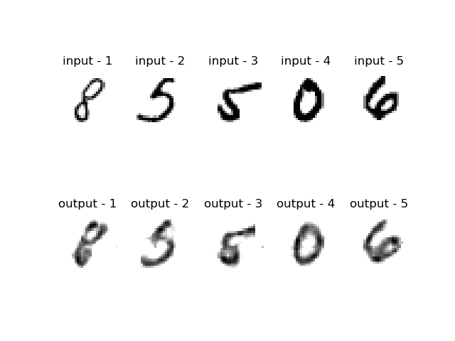

# Autoencoder Trial
This repository contains code for Autoencoder trained using TensorFlow. The model has the description as used in [this](model_params.json) json file.

## Dependencies
1. TensorFlow
2. Tqdm
3. Numpy
4. Matplotlib
5. Pandas

## Usage
Make a json file named ```model_params.json```, for example look [here](model_params.json) and then run command - ```python train.py```.
To visualize result run command - ```python visualize.py```

## Output
